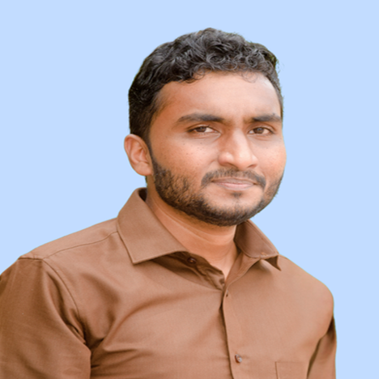
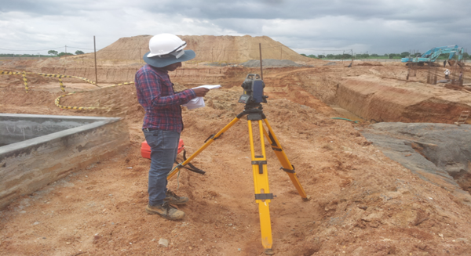

---
hide:
  - toc
  - navigation
---
<!--
CHECKLIST FOR THIS PAGE:
- [ ] Replace [YOUR NAME] with your full name (3 places)
- [ ] Replace [YOUR JOB TITLE] with your current or target role
- [ ] Replace [YOUR TAGLINE] with a short phrase describing your focus
- [ ] Rewrite the About Me paragraph with your own words
- [ ] Replace assets/images/profile.png with your actual photo (keep the filename or update it below)
- [ ] Replace assets/images/about.png with your own image (a field photo, map, or workspace shot)
- [ ] Edit the skill cards to match your actual skills (add, remove, or rename cards as needed)
- [ ] Update GitHub and LinkedIn links in the Connect section
- [ ] Add your CV PDF to docs/assets/ and update the filename in the Download CV button
-->

  
  <h1>Rifas Ahamed</h1>
  
<strong>Geospatial Data Analyst</strong>

  
<em>Turning spatial data into insights | GIS | Remote Sensing | Geo-Python | Civil Site Modelling(C3D)</em>

---

## About Me

I am a Geospatial Data Analyst and Survey Engineer with around six years of experience in various infrastructure projects, holding a ***B.Sc. in Surveying Sciences (Specialized in Cartography & GIS)*** from the Sabaragamuwa University of Sri Lanka. I specialize in GIS, Remote Sensing, and Geospatial data modeling, focusing on converting complex spatial data into actionable insights. Additionally, I work on civil site designing, utilizing Autodesk Civil 3D to deliver precise engineering layouts such site plans, grading layout, subdivision plans and workflows as a freelancer.

  

---

[View My Projects :material-arrow-right:](projects/index.md){ .md-button .md-button--primary }
[Download CV :material-download:](assets/Rifas-CV.pdf){ .md-button }

---

## Skills

-   :material-layers:{ .lg .middle } **GIS & Remote Sensing**

    ---

    - QGIS, ArcGIS Pro, MapLibre
    - Multispectral and SAR Image Analysis
    - Cloud Native Geospatial (Google Earth Engine)

-   :material-code-braces:{ .lg .middle } **Programming**

    ---

    - Python — GeoPandas, NumPy, Pandas, Matplotlib
    - R — sf, terra, ggplot2
    - SQL, PostgreSQL + PostGIS

-   :material-airplane:{ .lg .middle } **Drone / UAV Data Processing**

    ---

    - Mission planning and flight operations
    - Photogrammetry: Pix4DMapper, Agisoft Metashape, OpenDroneMap
    - Point cloud processing: CloudCompare, PDAL

-   :material-city-variant-outline:{ .lg .middle } **Civil Site Designing (AutoDesk Civil 3D)**

    ---

    - Land/ Property Site Plan
    - Land Subdivision Layout
    - Site Grading
    - Land Survey and Earthwork Quantity Reports    

---

## Connect

[GitHub](https://github.com/mrrifas92){ .md-button }
[LinkedIn](https://linkedin.com/in/geovizrifas){ .md-button }
